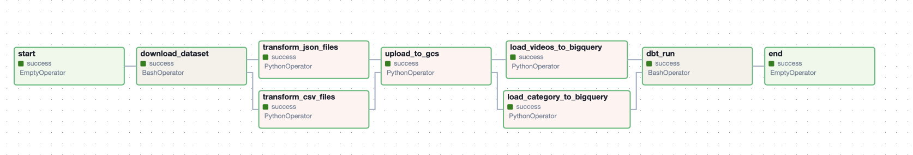

# Data Engineering - Youtube Trending Analysis

This project serves as the completion of the final project for the [Data Engineering ZoomCamp 2024](https://github.com/DataTalksClub/data-engineering-zoomcamp/tree/main?tab=readme-ov-file"). It aims to build an end-to-end data engineering pipeline for ingesting, processing, and analyzing data from Kaggle's  [YouTube trending videos dataset](https://www.kaggle.com/datasets/datasnaek/youtube-new/data"). The pipeline includes steps for data ingestion, preprocessing, loading into a cloud environment, and displaying insights through a dashboard.
## Problem Description
1. **How to find trending videos**
To identify the most popular videos on YouTube, we need a clear overview of the top-viewed videos. This is where the "Top Views Videos Table" comes in. By providing a concise list of the most-viewed videos, users can easily discover trending content and gain insights into what captures audience attention. This component facilitates quick access to trending videos, aiding content creators, marketers, and analysts in understanding current trends and optimizing their strategies to enhance visibility and engagement.

2. **Identifying influential channels**
Understanding the channels driving trends is crucial for content creators seeking collaborations and marketers aiming to leverage influential partnerships. The "Top Trending Channels Table" serves this purpose by highlighting the channels with the highest impact on trends. By presenting this information in a structured format, users can identify key players in their niche, explore potential collaboration opportunities, and devise strategic partnerships to expand their reach and audience engagement.

3. **Analyzing viewership trends**
To gain insights into audience behavior and content performance over time, it's essential to analyze viewership trends. The "Total Views Trend Over Time Line Chart" provides a visual representation of how viewership evolves for trending videos in each country. By tracking trends over time, users can identify patterns, spot emerging trends, and optimize content release schedules to maximize audience reach and engagement. This component empowers users to make data-driven decisions and adapt their strategies based on audience preferences and market dynamics.

4. **Understanding content preferences**
Categorizing trending videos helps users understand the types of content that resonate with audiences. The "Video Category Distribution Bar Chart" offers insights into popular themes and genres, enabling content creators and marketers to align their strategies with audience interests. By visualizing category distribution, users can identify niche opportunities, tailor content to meet audience preferences, and develop targeted marketing campaigns to drive engagement and growth. This component serves as a valuable tool for content strategy development and audience segmentation, enhancing overall content performance and audience satisfaction.
## Infrastructure

The following tools and technologies are used:

- Cloud - [**Google Cloud Platform**](https://cloud.google.com)
- Infrastructure as Code software - [**Terraform**](https://www.terraform.io)
- Containerization - [**Docker**](https://www.docker.com), [**Docker Compose**](https://docs.docker.com/compose/)
- Batch Processing - [**Python**](https://www.python.org)
- Orchestration - [**Airflow**](https://airflow.apache.org)
- Transformation - [**dbt**](https://www.getdbt.com)
- Data Lake - [**Google Cloud Storage**](https://cloud.google.com/storage)
- Data Warehouse - [**BigQuery**](https://cloud.google.com/bigquery)
- Data Visualization - [**Looker Studio**](https://cloud.google.com/looker-studio)

## Detail for infrastructure

**Before partitioning and clustering:**

**After partitioning and clustering:**

## Dashboard
Link to the dashboard: 
https://datastudio.google.com/reporting/c67883ee-7b3a-481f-a28f-e001b0c3c743

## How to run
Please check [how-to-run.md](./docs/how-to-run.md).

## Further improvement
- Run this airflow in cloud.
- Add clean up process.
- Refactor the dag for `youtube_analysis_ingestion.py`
- Unit test for airflow DAG
- CI/CD
- How to handle SCD for running every day without replace data inside tables.

## Special Mentions
I'd like to thank the [DataTalks.Club](https://datatalks.club) for offering this Data Engineering course completely free. If you want to upskill on Data Engineering technologies, please check out their self-paced [course](https://github.com/DataTalksClub/data-engineering-zoomcamp).